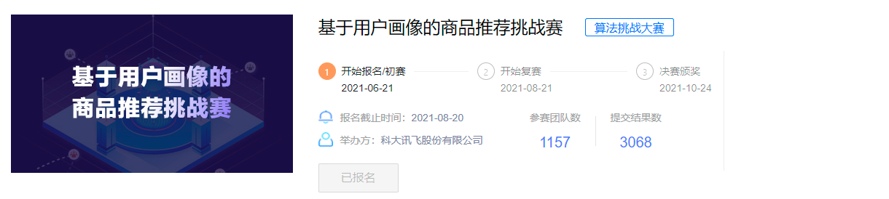
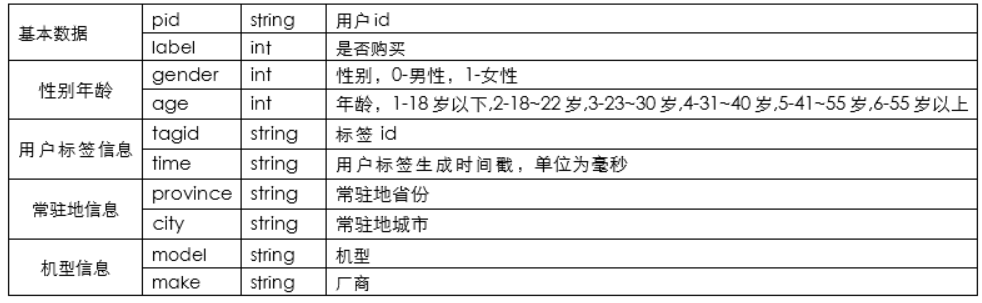
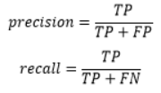
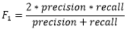

## 基于用户画像的商品推荐挑战赛

## 1、比赛说明

[基于用户画像的商品推荐挑战赛](http://challenge.xfyun.cn/topic/info?type=user-portrait)

### 1.1 赛题背景

讯飞AI营销云基于深耕多年的人工智能和大数据技术，赋予营销智慧创新的大脑，以健全的产品矩阵和全方位的服务，帮助广告主用AI+大数据实现营销效能的全面提升，打造数字营销新生态。

### 1.2 赛题任务

基于用户画像的产品推荐，是目前AI营销云服务广告主的一项重要能力，本次赛题选择了两款产品分别在初赛和复赛中进行用户付费行为预测，参赛选手需基于提供的样本构建模型，预测用户是否会购买相应商品。

### 1.3 数据说明

本次赛题是一个二分类任务，特征维度主要包括：基本数据，性别年龄、用户标签、常驻地信息、机型信息5类特征，出于数据安全的考虑，所有数据均为脱敏处理后的数据。初赛数据和复赛数据特征维度相同。

### 1.4 评测标准

本模型依据提交的结果文件，采用F1-score进行评价。

（1）统计TP（正确预测购买记录），FP（错将未购买记录预测为购买记录），FN（错将购买记录预测为未购买记录）

（2）通过第一步的统计值计算模型的precision和recall，计算公式如下：

（3）通过第二步计算结果计算F1-score,得到最后评测结果，计算方式如下：

## 2、比赛总结

|      |      |      |
| ---- | ---- | ---- |
|      |      |      |
|      |      |      |
|      |      |      |

